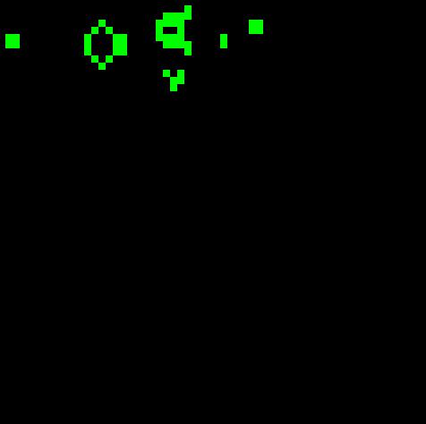

# Game of life

My implemenation of Conway's Game of Life using python (work in progress). It uses toroidal array to run simulation.




## How to run (in future will be dockerized)

```
git clone https://github.com/hubertpytkiewicz/game_of_life_pygame.git
cd game_of_life_pygame
python3 main.py [optional_argument]
```
It requires ```numpy``` and ```pygame``` packages.

## Options for running script

* ```--height [int]``` - Specifies height of board, default is 50
* ```--width [int]``` - Specifies width of board, default is 50
* ```--board [path]``` - Provides path to csv file, that contains starting position of board, if not specified will generate random board

## How to generate own custom board

Create your own csv file filled with 0s and 1s in a grid, for example:
```
0,0,0,0,0
0,0,0,0,0
0,1,1,1,0
0,0,0,0,0
0,0,0,0,0
```
where 1 marks alive cell, and 0 marks dead one. Then, run your board with:
```
python3 main.py --board path/to/your_file.csv
```

## Provided examples
- ```still_lifes``` - group of objects that will never evolve without outside activity
- ```glider``` - small object that moves forward indefinetly
- ```spaceship``` - bigger object that moves forward indefinetly
- ```gosper_gun``` - object that normally indefinetly generates gliders. In my example it will eventually "shoot" itself because I'm using toroidal space for board.
- ```bunnies``` - example of a group of objects called ```methuselahs```, which describes an object that takes a large number of generations to stabilize, and grows significantly during its evolution
- ```oscillatiors``` - example of two objects called ```oscillatiors```, which describes objects that will always repeat themselves during some period of time, given that there is no outside activity
